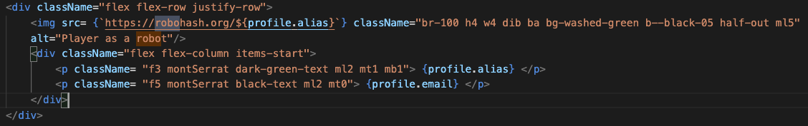
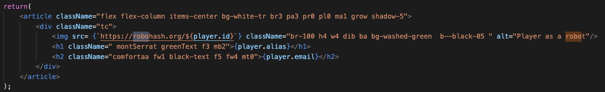
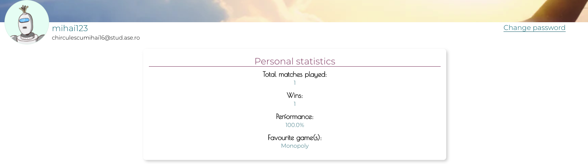
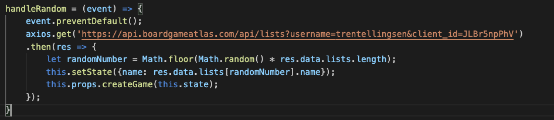
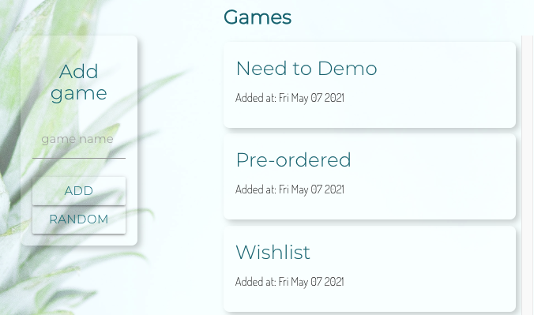
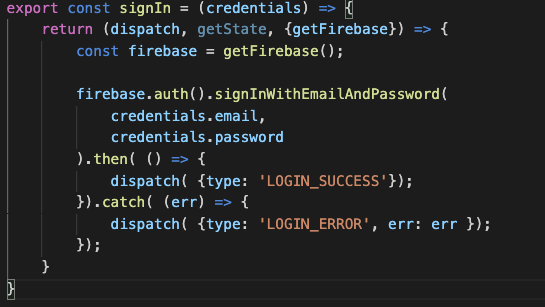
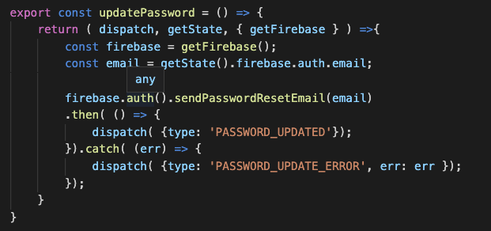
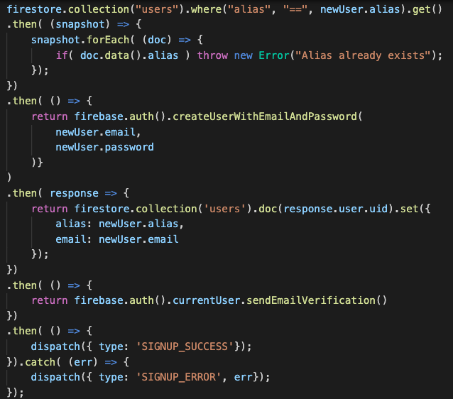

1)	Introducere & Descrierea problemei

The-Playground este o aplicație realizată pentru pasionații de boardgames. Aceasta are rolul de a ține evidența jucătorilor și statisticilor legate de utilizatorii care au participat la diferite jocuri și campionate. Aceasta are scopul de a vedea cine este cel mai bun jucător de „boardgames” dintr-un grup pe perioada unui an.

Arhitectura aplicației este Single-Page Application. Partea de front-end conține o interfață dezvoltată cu ReactJS și Redux. Partea legată de back-end a fost realizată cu NodeJS și ExpressJS, accesul la date este realizat fie prind intermediul aplicației, fie prin intermediul a două API. Datele ce sunt generate prin intermediul unui API sunt pozele de profil ale utilizatorilor și un joc random în secțiunea dedicată creării de noi jocuri. În ceea ce privește stocarea datelor, acestea sunt stocate într-o bază de date nerelațională, aceasta fiind FireStore.

Pentru a accesa aplicație, fiecare utilizator trebuie să creeze un cont, după care va primi un mail de confirmare. După ce accesează mailul de confirmare, utilizatorul se poate loga în aplicație.

Aplicația folosește servicii precum FireStore și Firebase.

2)	Descriere API

Datele ce sunt generate prin API sunt:
•	Pozele de profil ale utitlizatorilor
•	Un joc random, prin intermediul unui button, în secțiunea dedicată creării de jocuri noi

1)	Pozele de profil ale utilizatorilor

API-ul folosit pentru generarea de poze de profil pentru utlizatori se numește „RoboHash”. El este accesat în fișierele PlayersDetails.js și Profile.js. Generarea pozelor de profil pentru utilizatori este realizată automat.

Rezultatul acestui API poate să fie observat în aplicație pentru fiecare cont în parte, la secțiunea Profil.

2)	Generarea de joc random

În fisierul GameForm, există funția handleRandom. Aceasta are rolul de a genera un joc random la apăsarea unui button din aplicație dedicat acestei acțiuni. Generarea de un joc este realizată prin intermediul API-ului.

În aplicație API-ul este folosit prin intermediul unui button numit „Random” iar rezultatul poate să fie observat în poza de mai jos:

3)	Flux de date

Date sunt stocate într-o bază de date nerelațională, FireStore, de unde sunt și luate pentru a fi utilizate în cadrul aplicației. Datele sunt folosite pentru acțiuni precum sign-up, sign-in, creare de jocuri etc. În transmiterea de date au fost utilizate metode request și response (get & set). 

Exemple de astfel de metode pot fi observate în capturile de ecran prezentate mai jos

*Metoda signin

*Metoda update password

*Metoda signup

4)	Pornirea aplicației în mod de dezvoltare

Pentru pornirea aplicației se va folosi comanda: npm start

Aplicația va rula pe portul localhost:3000.

Dacă se vor face modificări, aplicația se va reîncărca

Dacă vor fi erori, acelea vor fi afiște în consolă
